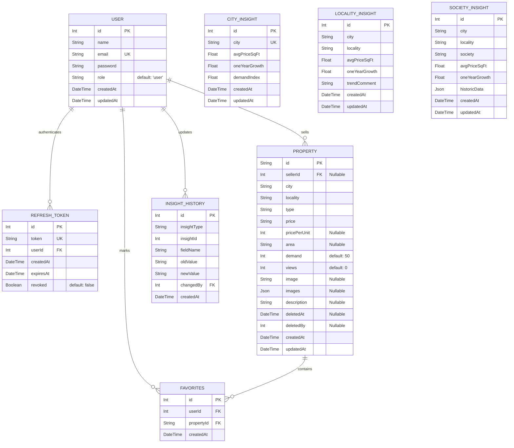

# HomeQuest – Property & Real Estate Marketplace (AI Agent Developer Guide)

Welcome to **HomeQuest**, a high-performance, full-stack real-estate portal built with modern web technologies. This directory serves as the centralized documentation hub. 

If you are an **AI Agent** or developer onboarding onto this repository, this document provides complete architectural blueprints, database details, API routes, authentication logic, and developer guidelines to help you contribute safely and efficiently.

---

## 🗺️ High-Level Architecture & Monorepo Structure

HomeQuest is built as a monorepo consisting of a React-based single-page application (SPA) on the frontend and an Express.js-based REST API on the backend backed by Prisma ORM and MySQL.

```
HomeQuest1/
├── frontend/                     # React.js SPA Frontend
│   ├── public/                   # Static assets & public index.html
│   ├── src/
│   │   ├── components/           # Reusable UI elements & Router Guards
│   │   │   ├── AgentRoute.jsx     # Protects views for Agent role only
│   │   │   ├── ProtectedRoute.js  # Protects views for logged-in Users/Agents/Admins
│   │   │   ├── PropertyCard.jsx   # Grid item for property visual listing
│   │   │   ├── PropertyChatBot.jsx# AI chatbot overlay component
│   │   │   ├── SearchBar.jsx      # Multi-criteria filter search block
│   │   │   └── ...
│   │   ├── pages/                # Views bound to React Router
│   │   │   ├── Home.jsx           # Main landing, property listings
│   │   │   ├── Insights.jsx       # Real estate price metrics by locality
│   │   │   ├── Profile.jsx        # Account and setting controls
│   │   │   ├── PropertyDetails.jsx# Detailed view of a selected listing
│   │   │   ├── Shortlist.jsx      # User saved/favorited listings
│   │   │   ├── AgentUpload.jsx    # Real-estate list publisher for agents
│   │   │   ├── Chat.jsx           # Real-time WebSockets agent/user interface
│   │   │   ├── EMICalculator.jsx  # Interactive loan visual calculator
│   │   │   └── ...
│   │   ├── services/             # API client services
│   │   │   ├── api.js             # Axios client with interceptors & JWT refresh
│   │   │   └── propertyAPI.js     # Property API query client
│   │   ├── index.css             # Main stylesheet (Tailwind & custom light variables)
│   │   └── index-dark.css        # Premium custom dark variables & animations
│   ├── package.json              # Frontend package definitions
│   └── tailwind.config.js        # Styling system configs
│
├── backend/                      # Node.js + Express.js API
│   ├── prisma/
│   │   └── schema.prisma         # Prisma Schema for MySQL Database models
│   ├── middleware/
│   │   └── auth.js               # JWT verification & request context hydration
│   ├── routes/                   # Router endpoints grouping
│   │   ├── properties.js         # /api/properties endpoints
│   │   ├── insights.js           # /api/insights endpoints
│   │   ├── favorites.js          # /api/favorites endpoints
│   │   ├── contact.js            # /api/contact form submitters
│   │   ├── deals.js              # /api/deals client proposals
│   │   ├── uploads.js            # file asset multi-part handlers
│   │   ├── chats.js              # Socket.io chat handlers & logs
│   │   ├── profile.js            # /api/profile management
│   │   ├── llm.js                # AI property chat agent gateway
│   │   └── payments.js           # Payment gateway simulation
│   ├── controllers/              # Request handlers (Prisma integrations)
│   │   ├── propertiesController.js
│   │   ├── insightsController.js
│   │   ├── ...
│   ├── server.js                 # Entry point, Express app, HTTP Server & Socket.io
│   └── package.json              # Backend package definitions
└── README.md                     # This documentation file
```

---

## 🗄️ Database Schema & Prisma Models

The data layer uses **MySQL** managed through **Prisma ORM**. When reading or writing queries in the backend, always reference these active entities:



### 🗝️ Key Schema Details
1. **Relations & Cascades**: 
   - `Favorites`, `RefreshToken`, `Property`, and `InsightHistory` all use `@relation(fields: [...], references: [id], onDelete: Cascade)` pointing back to the parent `User` schema.
2. **Soft Deletions**: 
   - `Property` implements a soft delete mechanism using `deletedAt` (DateTime, Nullable) and `deletedBy` (Int, Nullable).
3. **Compound Constraints**:
   - `Favorites` uniquely identifies pairs using `@@unique([userId, propertyId])`.
   - `LocalityInsight` uniquely groups insights with `@@unique([city, locality])`.
   - `SocietyInsight` uniquely maps items with `@@unique([city, locality, society])`.

---

## 🔐 Authentication, Session & Token Flow

HomeQuest implements a dual-token (Access + Refresh) secure stateless session architecture:

```
[ Frontend Client ]                                      [ Backend API ]
         │                                                      │
         │ ─── (1) POST /api/auth/login with credentials ─────> │
         │ <── (2) Return Access JWT + HTTP-Only Cookie ─────── │
         │                                                      │
         │ ─── (3) Add Access JWT in Auth Interceptor Header ──> │
         │ <── (4) Return Requested Secure Data ──────────────── │
         │                                                      │
     [Access Token Expires (401)]                               │
         │ ─── (5) Interceptor catches 401 ─────────────────────> │
         │ ─── (6) POST /api/auth/refresh (Cookie read) ──────> │
         │ <── (7) Rotates Refresh Token & returns new JWT ──── │
         │ ─── (8) Retries the original failed request ────────> │
```

### Backend Details (`backend/middleware/auth.js`)
- Access JWT tokens are extracted from `req.headers.authorization` as `Bearer <token>`.
- The token is decrypted against `JWT_SECRET`. If valid, the user metadata payload is hydrated into `req.user` and `req.userId` for consumption inside downstream route controllers.

### Frontend Details (`frontend/src/services/api.js`)
- **Request Interceptor**: Extracts the access token from `localStorage` under key `token`, injecting it as `Authorization: Bearer <token>` into all outbound HTTP requests.
- **Response Interceptor**: Automatically catches `401 Unauthorized` errors. It attempts token rotation via the `/api/auth/refresh` endpoint (which exchanges the backend HttpOnly Cookie refresh token for a new access token), updates `localStorage`, and retries the original aborted request seamlessly without logging out the user.

---

## 🤖 Real Estate AI Chatbot Companion (`backend/controllers/llmController.js`)

Each property details view includes an AI property chat assistant.
- **Core Engine**: Integrates with OpenAI's `gpt-4o-mini` API.
- **Prompt Isolation**: Restricts context using the `createPromptContext` utility:
  ```javascript
  const createPromptContext = (propertyData) => {
    const system = `You are a property assistant. Only use the provided property data JSON to answer questions. If the user's question is outside the provided data, respond with: "I can only answer questions about this property."`;
    const context = `PROPERTY_JSON_START\n${JSON.stringify(propertyData)}\nPROPERTY_JSON_END`;
    return { system, context };
  };
  ```
- **Fallback Simulation**: If no `OPENAI_API_KEY` environment variable is detected in `.env`, the controller gracefully falls back to a fast, local regular-expression-based engine that parses questions about price, location, area, and developer rules directly from the localized property object, ensuring zero disruption during local development offline.

---

## ⚡ Real-Time WebSockets Engine (`backend/server.js`)

Integrated using **Socket.io** over an HTTP server adapter.
- Real-time rooms are dynamically established based on chat conversation IDs:
  - Event `join` puts users or agents in specific listing discussion namespaces.
  - Event `leave` detaches active sockets.
  - Event triggers from HTTP routes fetch the stored instances and broadcast the message payloads asynchronously.

---

## 🔌 API Route Catalog (Backend Endpoints)

| Route Group | Path | Method | Auth Required | Admin/Agent | Description |
| :--- | :--- | :--- | :---: | :---: | :--- |
| **Auth** | `/api/auth/signup` | POST | ❌ | - | Registers standard user, agent, or admin account |
| | `/api/auth/login` | POST | ❌ | - | Authenticates credentials and sets HTTP-Only Refresh cookies |
| | `/api/auth/refresh` | POST | ❌ | - | Rotates cookie refresh token; yields a fresh Access JWT |
| | `/api/auth/logout` | POST | ❌ | - | Revokes refresh tokens and clears cookies |
| **Properties**| `/api/properties` | GET | ❌ | - | Query listing parameters (city, type, pagination, sorting) |
| | `/api/properties/:id` | GET | ❌ | - | Fetches individual details and increments views |
| | `/api/properties` | POST | 🔑 | Agent | Creates new real estate listing with image uploads |
| | `/api/properties/:id` | PUT | 🔑 | Agent / Admin| Updates active listing data |
| | `/api/properties/:id` | DELETE| 🔑 | Agent / Admin| Flags a listing as deleted (soft delete) |
| | `/api/properties/deleted`| GET | 🔑 | Admin | Retrieves soft-deleted assets |
| | `/api/properties/:id/recover`| POST| 🔑 | Admin | Restores a soft-deleted property |
| **Insights** | `/api/insights/cities` | GET | ❌ | - | Fetches array of cities configured in database |
| | `/api/insights/city` | GET | ❌ | - | Pulls visual analytics & Growth charts for single city |
| | `/api/insights/locality`| GET | ❌ | - | Locality-level average pricing indices and trends |
| | `/api/insights/society` | GET | ❌ | - | Society level breakdown and historic json files |
| | `/api/insights/history` | GET | 🔑 | Admin | Returns comprehensive insight update histories |
| | `/api/insights/undo` | POST | 🔑 | Admin | Restores historical state for analytical records |
| **Shortlist** | `/api/favorites` | GET | 🔑 | - | Gets personalized favorites for active profile |
| | `/api/favorites` | POST | 🔑 | - | Shortlists a property details item |
| | `/api/favorites/:id` | DELETE| 🔑 | - | Disassociates a listing from favorites |
| **Contact** | `/api/contact` | POST | ❌ | - | Submits queries or schedules inspections with details |
| **Deals** | `/api/deals` | GET | 🔑 | Agent | Views proposals associated with logged-in Agent |
| | `/api/deals/offer` | POST | 🔑 | Agent | Submits counter-offers or proposal amendments |

---

## 🧮 Frontend Interactive Calculators & Math Specs

HomeQuest equips users with several heavy-duty financial utilities:

### 1. EMI Calculator (`frontend/src/pages/EMICalculator.jsx`)
- Computes monthly repayment profiles, principal-to-interest ratios, and amortization plans.
- **Formula**:
  $$\text{EMI} = \frac{P \times r \times (1 + r)^n}{(1 + r)^n - 1}$$
  *Where:*
  - $P$ = Principal Loan Amount
  - $r$ = Monthly interest rate (Annual Rate / 12 / 100)
  - $n$ = Loan tenure in months (Years $\times$ 12)

### 2. Budget Planner (`frontend/src/pages/BudgetCalculator.jsx`)
- Assesses overall affordability based on take-home pay, down payment liquidity, debts, and local taxes, applying conservative banking standard limits (e.g., maximum 40% debt-to-income margin).

### 3. Loan Eligibility Estimator (`frontend/src/pages/LoanEligibility.jsx`)
- Evaluates real-time borrowing capabilities by processing age, salary profiles, existing monthly obligations (FOIR), and credit scores.

### 4. Area Unit Converter (`frontend/src/pages/AreaConverter.jsx`)
- Converts dimensional boundaries back and forth across global standards: Square Feet, Square Meters, Square Yards, Acres, and local South Asian land standards (Bigha, Marla, Guntha).

---

## 🛠️ Step-by-Step Setup Guide

Follow these sequential steps to boot the local developer environment:

### Prerequisites
- Node.js (v18 or higher recommended)
- MySQL Server (running locally or cloud instances)

### 1. Setup Backend
1. Navigate to the backend directory:
   ```bash
   cd backend
   ```
2. Install dependecies:
   ```bash
   npm install
   ```
3. Set up your `.env` variables:
   ```env
   PORT=5001
   DATABASE_URL="mysql://<user>:<password>@localhost:3306/homequest"
   JWT_SECRET="your-super-long-secure-secret-key"
   REFRESH_TOKEN_TTL_DAYS=30
   OPENAI_API_KEY="your-optional-openai-key"
   FRONTEND_URL="http://localhost:3000"
   ```
4. Run Prisma commands to generate the JS client wrapper and apply migrations:
   ```bash
   npx prisma generate
   npx prisma migrate dev --name init
   ```
5. Initialize the development database server instance:
   ```bash
   npm run dev
   ```

### 2. Setup Frontend
1. Navigate to the frontend directory:
   ```bash
   cd ../frontend
   ```
2. Install package libraries:
   ```bash
   npm install
   ```
3. Create your `.env` file:
   ```env
   REACT_APP_API_URL=http://localhost:5001
   ```
4. Fire up the hot-reloading development server:
   ```bash
   npm run dev
   ```

---

## 🧑‍💻 AI Agent Contribution Rules & Guidelines

When modifying this repository, follow these precise guidelines to maintain stability and clean code:

### 1. Prisma & DB Modifications
* **Rule**: Never mutate backend model endpoints without checking and syncing `backend/prisma/schema.prisma` first.
* **Flow**: Always execute `npx prisma generate` immediately inside `/backend` following schema changes, then generate standard prisma migrations `npx prisma migrate dev`.

### 2. Styling System
* **Rule**: HomeQuest uses **Tailwind CSS** as its foundation, combined with deep customized aesthetic stylesheets located at `frontend/src/index.css` and `frontend/src/index-dark.css`.
* **Dark Mode**: High-end styling uses a premium dark theme. Ensure new components implement Tailwind dark utilities properly (`dark:bg-slate-900`, `dark:text-white`) and support local state switches.

### 3. Error Handling & API Contracts
* **Rule**: All async operations in controllers MUST run within standard `try...catch` scopes.
* **Contract**: Always return unified JSON payloads in errors, strictly keeping responses formatted as `{ error: "Error details and statements" }` or `{ success: false, error: "..." }`.

### 4. Route Security Guards
* **Rule**: Ensure routes that display sensitive user profiles, create new property advertisements, or track payments are wrapped inside `<ProtectedRoute>` or `<AgentRoute>` components on the frontend, and verify that backend routes validate standard `verifyToken` middlewares.
